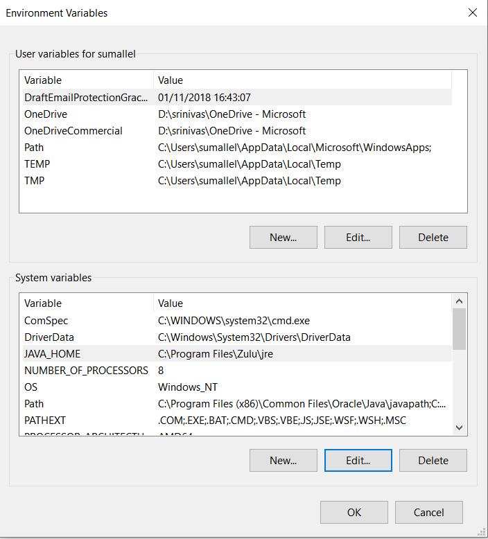

Below diagram explains the steps to migrate from Oracle JRE to Azul Zulu OpenJDK for TFS 2018 Update 2.

## Step 1: Pause Search indexing
Go to https://github.com/Microsoft/Code-Search and find the right folder based on the TFS version you are using. For TFS 2018 Update 2, go to https://github.com/Microsoft/Code-Search/tree/master/TFS_2018Update2. To pause all indexing, execute the script PauseSearchIndexing.ps1 from Windows PowerShell with administrative privileges. You will be prompted to enter:

* The SQL server instance name where the TFS configuration database resides.
* The name of the TFS configuration database.

## Step 2: Stop Elasticsearch Service
Open Command Prompt as an administrator 

If Elasticsearch is installed on the same server as TFS (local installation), use below command to locate ES folder. For remote search installations, locate the ES installation path and change the directory accordingly.
### Change directory: 
cd "C:\Program Files\Microsoft Team Foundation Server 15.0\Search\ES\elasticsearch-5.4.1\bin"
### Stop the service:
execute "elasticsearch-service.bat stop"

## Step 3: Download and Install Azul Zulu Java 
Download and install [OpenJDK 7u201](https://cdn.azul.com/zulu/bin/zulu7.25.0.5-jdk7.0.201-win_x64.msi)

## Step 4: Update JAVA_HOME with Azul Zulu path

## Step 5: Start Elasticsearch Service
Open Command Prompt as an administrator 

If Elasticsearch is installed on the same server as TFS (local installation), use below command to locate ES folder. For remote search installations, locate the ES installation path and change the directory accordingly.
### Change directory: 
cd "C:\Program Files\Microsoft Team Foundation Server 15.0\Search\ES\elasticsearch-5.4.1\bin"
### Start the service:
execute "elasticsearch-service.bat start"

## Step 6: Resume Search indexing
Go to https://github.com/Microsoft/Code-Search and find the right folder based on the TFS version you are using. For TFS 2018 Update 2, go to https://github.com/Microsoft/Code-Search/tree/master/TFS_2018Update2. Execute the script ResumeSearchIndexing.ps1 with administrative privileges to resume indexing again. You will be prompted to enter:

* The SQL server instance name where the TFS configuration database resides.
* The name of the TFS configuration database.

